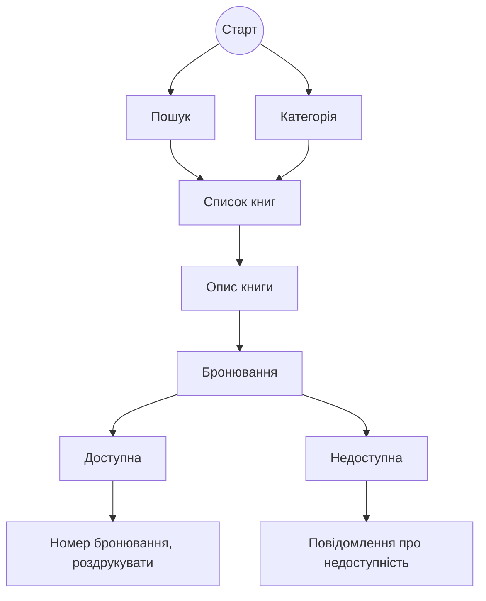

# Завдання 1. EP & BVA для категорії квитка

**Категорії:**

| Категорія | Назва      | Вік   | Вартість |
| --------- | ---------- | ----- | -------- |
| 1         | Діти       | 0-12  | 50       |
| 2         | Підлітки   | 13-17 | 100      |
| 3         | Дорослі    | 18-64 | 150      |
| 4         | Літні люди | 65+   | 80       |

## Класи еквівалентності (EP):

-   **Валідні класи (V):**

    -   0–12 (діти)
    -   13–17 (підлітки)
    -   18–64 (дорослі)
    -   65+ (літні люди)

-   **Невалідні класи (InV):**
    -   негативне значення
    -   неціле число
    -   не число

## Граничні значення (BVA):

Для кожного класу беремо значення на межі:

-   Межі між класами: 0, 12, 13, 17, 18, 64, 65

**Тестові випадки (EP+BVA):**

| №   | Вік     | Категорія  | Тип    | Очікуваний результат |
| --- | ------- | ---------- | ------ | -------------------- |
| 1   | 0       | Діти       | V, BVA | 50                   |
| 2   | 5       | Діти       | V      | 50                   |
| 3   | 12      | Діти       | V, BVA | 50                   |
| 4   | 13      | Підлітки   | V, BVA | 100                  |
| 5   | 15      | Підлітки   | V      | 100                  |
| 6   | 17      | Підлітки   | V, BVA | 100                  |
| 7   | 18      | Дорослі    | V, BVA | 150                  |
| 8   | 40      | Дорослі    | V      | 150                  |
| 9   | 64      | Дорослі    | V, BVA | 150                  |
| 10  | 65      | Літні люди | V, BVA | 80                   |
| 11  | 100     | Літні люди | V      | 80                   |
| 12  | -1      | InV        | InV    | Помилка              |
| 13  | 6.5     | InV        | InV    | Помилка              |
| 14  | "текст" | InV        | InV    | Помилка              |

**Мінімальна кількість тестів (Nmin):**

-   Всі граничні значення валідного класу: 7
-   По 1 значенню валідного класу для кожної категорії: 4
-   Мінімум невалідних класів: 3

    $N_{\text{min}} = 7 + 4 + 3 = 14$

# Завдання 2. Таблиця рішень (Decision Table)

## Умови:

-   Тривалий термін (більше ніж на 10 днів): знижка 12%
-   Постійний клієнт: знижка 8%
-   Передплата: додаткова знижка 5%

**Умови (True/False):**

1. Тривалий термін (>10)
2. Постійний клієнт
3. Передплата

**Всі сценарії:**

| №   | Тривалий термін | Постійний клієнт | Передплата | Знижка $n$ (%) | $Q$        | Приклад $N=1000$ |
| --- | --------------- | ---------------- | ---------- | -------------- | ---------- | ---------------- |
| 1   | False           | False            | False      | 0              | $Q=N*1$    | 1000             |
| 2   | False           | False            | True       | 5              | $Q=N*0.95$ | 950              |
| 3   | False           | True             | False      | 8              | $Q=N*0.92$ | 920              |
| 4   | False           | True             | True       | 13             | $Q=N*0.87$ | 870              |
| 5   | True            | False            | False      | 12             | $Q=N*0.88$ | 880              |
| 6   | True            | False            | True       | 17             | $Q=N*0.83$ | 830              |
| 7   | True            | True             | False      | 20             | $Q=N*0.80$ | 800              |
| 8   | True            | True             | True       | 25             | $Q=N*0.75$ | 750              |

# Завдання 3. State Transition Test Scenarios

## **Стан**:

-   Початковий: стартова сторінка
-   Пошук: пошук книги (за автором, назвою, категорією, ISBN)
-   Перехід: натискання на категорію або книгу
-   Опис: сторінка опису книги
-   Бронювання: спроба бронювання

## **Можливі переходи:**

1. Старт -> Пошук / Категорія
2. Пошук -> Список книг
3. Категорія -> Список книг
4. Список книг -> Опис книги
5. Опис книги -> Бронювання
6. Бронювання -> доступна -> номер бронювання, роздрукувати
7. Бронювання -> недоступна -> повідомлення про недоступність]

## **Тестові сценарії:**

| №   | Сценарій                                                                                      | Очікуваний результат           |
| --- | --------------------------------------------------------------------------------------------- | ------------------------------ |
| 1   | Користувач шукає книгу за автором -> відкриває опис -> бронює доступну книгу                  | Номер бронювання               |
| 2   | Користувач шукає книгу за назвою -> відкриває опис -> намагається бронювати, книга недоступна | Повідомлення про недоступність |
| 3   | Користувач натискає на категорію -> бачить список -> обирає книгу -> опис -> бронює           | Номер бронюваня/повідомлення   |
| 4   | Користувач шукає за ISBN -> обирає книгу -> опис -> бронює                                    | Номер бронюваня/повідомлення   |
| 5   | Відкриття опису книги без пошуку (через категорію)                                            | Можливість забронювати         |
| 6   | Спроба бронювання коли книга вже зайнята                                                      | Повідомлення про недоступність |
